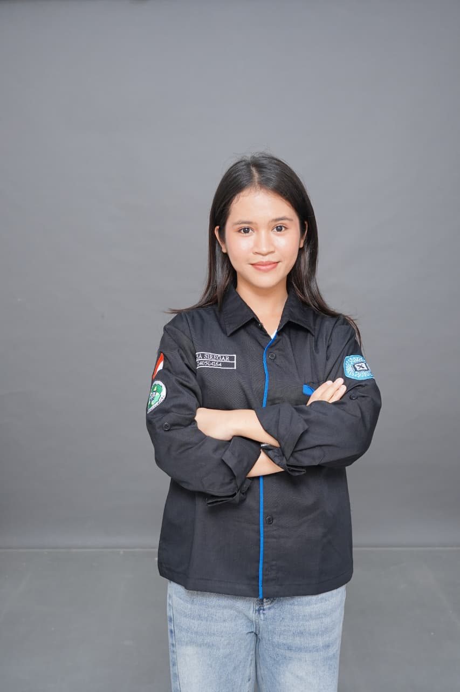

<!DOCTYPE html>
<html lang="id">
<head>
  <meta charset="UTF-8">
  <meta name="viewport" content="width=device-width, initial-scale=1.0">
  <title>Portofolio Elsa</title>

  <!-- FONT -->
  <link rel="preconnect" href="https://fonts.googleapis.com">
  <link href="https://fonts.googleapis.com/css2?family=Poppins:wght@300;400;500;600;700&display=swap" rel="stylesheet">

  
</head>

<body>

  <!-- NAVBAR -->

  <nav>
    <ul>
      <li><a href="#">Home</a></li>
      <li><a href="#about">About</a></li>
      <li><a href="#skill">Skills</a></li>
      <li><a href="#project">Project</a></li>
      <li><a href="#contact">Contact</a></li>
    </ul>
  </nav>

  <!-- HERO -->

  <section class="hero">

    

      

        <h3 class="hello">Hello Everyone 👋</h3>

        <h1>Elsa Siregar</h1>

        

          Mahasiswa yang tertarik pada dunia teknologi,
          desain website, dan pemrograman HTML & CSS.
          Saya suka membuat tampilan website modern,
          aesthetic, dan interaktif.
        

        <!-- MINI INFO -->

  

    

      
✨ Creative

      

        Suka membuat desain website aesthetic,
        modern, dan nyaman dilihat.
      

    

  

  

    

      
💻 Coding

      

        Bisa menggunakan HTML dan CSS
        untuk membuat website sederhana.
      

    

  

  

    

      
🚀 Active

      

        Aktif belajar hal baru dan
        mengembangkan skill coding.
      

    

  

        <!-- BUTTON -->

        

          <a href="cv.jpg" class="btn" target="_blank">
            View CV
          </a>

          <a href="#about" class="btn">
            Explore Portofolio
          </a>

        

      

      <!-- FOTO -->

      

        
      

    

  </section>

  <!-- ABOUT -->

  <section id="about">

    <h2 class="title">About Me</h2>

    

      

        <h3>🎓 Pendidikan</h3>
        

          Mahasiswa yang sedang belajar dan
          mengembangkan kemampuan dalam bidang
          teknologi informasi.
        

      

      

        <h3>💻 HTML</h3>
        

          Bisa membuat struktur website sederhana
          menggunakan HTML.
        

      

      

        <h3>🎨 CSS</h3>
        

          Bisa mendesain tampilan website
          agar lebih menarik dan modern.
        

      

    

  </section>

  <!-- SKILLS -->

  <section id="skill">

    <h2 class="title">My Skills</h2>

    

      

        <h3>💻 HTML</h3>
        

          Bisa membuat struktur website sederhana
          menggunakan HTML.
        

      

      

        <h3>🎨 CSS</h3>
        

          Bisa mendesain tampilan website
          agar lebih menarik dan modern.
        

      

    

  </section>

  <!-- WHY ME -->

  <section id="project">

    <h2 class="title">My Projects</h2>

    

      

        <h3>💡 Innovative Ideas</h3>
        

          Suka mencari ide baru untuk membuat
          tampilan website lebih menarik dan modern.
        

      

      

        <h3>🎨 Creative Design</h3>
        

          Menyukai desain website aesthetic,
          modern, dan nyaman dilihat.
        

      

      

        <h3>🌟 Positive Person</h3>
        

          Memiliki semangat belajar yang tinggi
          dan suka mencoba hal-hal baru.
        

      

    

  </section>
  <section id="crud">
  <h2 class="title">CRUD Mini (Data Project)</h2>

  <!-- INI YANG KAMU MAKSUD INPUT TYPE -->
  

    
    <input type="text" id="inputData" placeholder="Nama project"
      style="padding:10px; width:250px; border-radius:10px; border:none;">

    <input type="text" id="inputDesc" placeholder="Deskripsi project"
      style="padding:10px; width:250px; border-radius:10px; border:none;">

    <button onclick="tambahData()"
      style="padding:10px 15px; border-radius:10px; background:#38bdf8; border:none; color:white;">
      Tambah
    </button>

  

  

</section>
</section>

  <!-- CONTACT -->

  <section id="contact" class="contact">

    <h2 class="title">Contact Me</h2>

    

      Terima kasih telah mengunjungi portfolio saya ✨
    

    

      <a href="https://instagram.com/els_aa022" target="_blank">
        Instagram
      </a>

      <a href="https://wa.me/628xxxxxxxxxx" target="_blank">
        WhatsApp
      </a>

    

  </section>

  <!-- FOOTER -->

  <footer>
    
© 2026 Elsa Siregar | Portofolio Website

  </footer>
  
</body>
</html>
